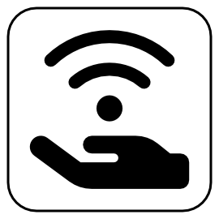

# The Clean Internet

*Respecting ourselves a bit more*

&nbsp;

While Wikipedia calls the dead internet a conspiracy theory, "enshittification" has been proclaimed the word of the year by various organisations ever since it was first uttered. This in itself is a bit strange. They are not exactly the same, but they are as related to each other as inbred cousins.

By now, I think everybody has noticed the *dead* part as well as the *shit* part. Serves us right for allowing an advertising company to manage what was supposed to be this greatest invention of humankind, this overpowered lubricant for the free flow of ideas and knowledge, and what makes us humans the peculiar creatures we are.

To emphasise the importance of the internet in today's world is like writing one of those school essays starting with "water is essential to life". But what's strangest of all is that we don't seem to be inclined to do anything about what's happening to this second environment of ours. Unlike society or nature, there are no movements to clean up the internet, or at least make it a slightly more *human* and *humane* place. It looks like we're satisfied with wallowing in our own shit, and have our experience of the "inter-connected world" reduced to that of a thieves' bazaar at its best, and a socially-engineered dehumanised dystopia at its FAANG.

There's one thing to "take on the system", as useless (and some would say edgy) as that is, but quite another to see society itself being so utterly apathetic. As a simple individual who cannot do anything against any of these cosmic forces, I'll just pretend that the world is a tiny bit better than it is.

I'll pretend there exists a *clean internet movement*, a natural reaction to the dark patterns and scummy practices which constitute the zombified body of this great gathering place of humanity.

A clean internet does none of these things. What it does is simply, but truly, **respect** its users. It's that simple.

